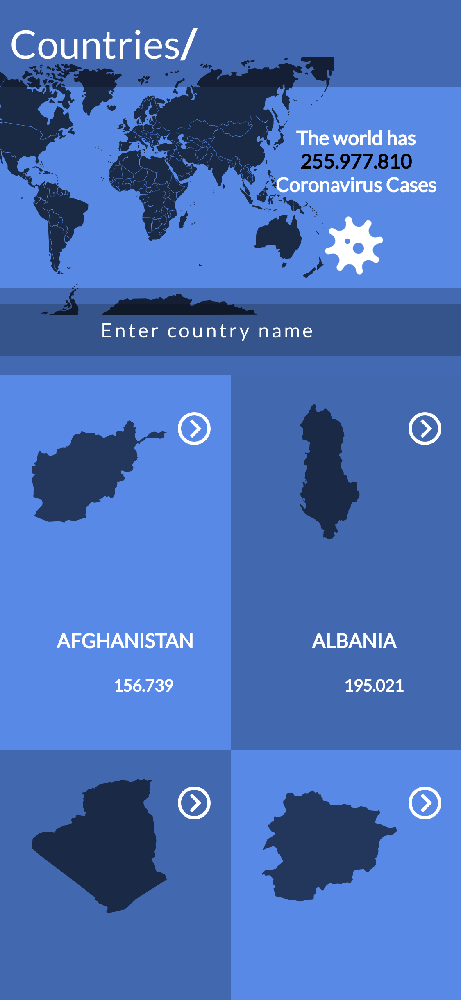
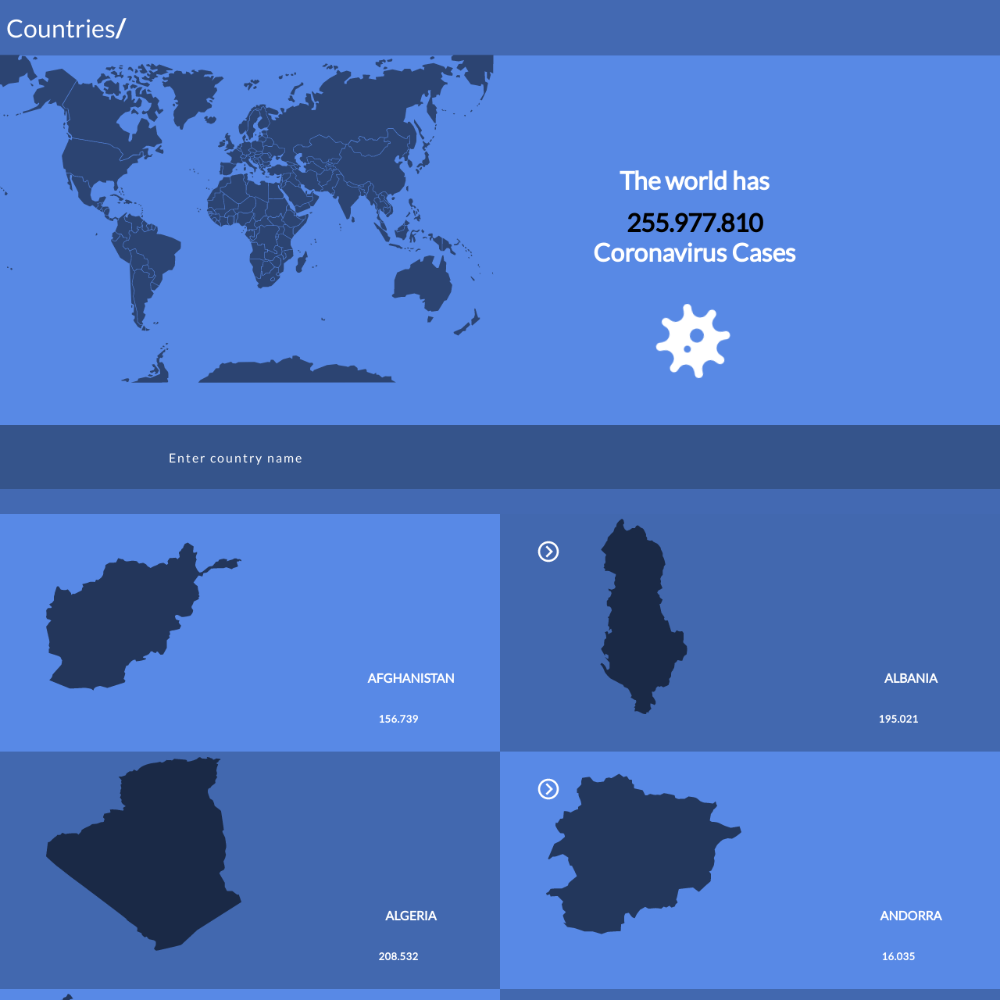

# Covid-19_Tracker_App
This Mobile web applicat is a Covid-19 data tracking App by Country , the data is from [Narrativa API](https://covid19tracking.narrativa.com/index_en.html).




## Built With

- React
- JSX
- Redux
- [CORONAVIRUS DATA API - COVID-19 TRACKING PROJECT](https://covid19tracking.narrativa.com/index_en.html)

## Live Demo

- [Live Demo Link](https://competent-bartik-b0682f.netlify.app/#/)

## Getting Started

To get a local copy up and running follow these simple example steps.

```
git clone https://github.com/mahbubul14/Space-travelers.git
```

and then run

```
npm i
```

## Available Scripts

In the project directory, you can run:

### `npm start`

Runs the app in the development mode.\
Open [http://localhost:3000](http://localhost:3000) to view it in the browser.

The page will reload if you make edits.\
You will also see any lint errors in the console.

### `npm test`

Launches the test runner in the interactive watch mode.\
See the section about [running tests](https://facebook.github.io/create-react-app/docs/running-tests) for more information.

### `Installation`

to build a production version to `bulid` folder run

```
npm run build
```

## Author

👨 **Mahbubul Alam**

- GitHub: [@mahbubul14](https://github.com/mahbubul14)
- Twitter: [@twitterhandle](https://twitter.com/mahbubul_14)
- LinkedIn: [LinkedIn](https://www.linkedin.com/in/mahbubul-alam-20595/)

## 🤝 Contributing

Contributions, issues, and feature requests are welcome!

Feel free to check the [issues page](https://github.com/mahbubul14/covid-19_tracking_app/issues).

## Show your support

Give a ⭐️ if you like this project!

## Acknowledgments
- [Nelson Sakwa](https://www.behance.net/sakwadesignstudio) for a great design.
- [Narrativa API](https://covid19tracking.narrativa.com/index_en.html) for creating the API.
